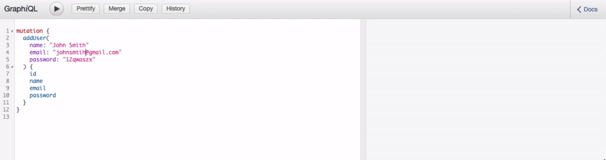

# GraphQL E-commerce Dummy Backend

## The Motivation
The idea behind this project was to see if it was possible to create a backend for a sample e-commerce website using GraphQL rather than conventional REST API's. The structure of the project follows a conventional MVC structure, so it may have been an overkill for this particular project, but I wanted to build it regardless to see how complex the relationships would be between the models. In a business environment, GraphQL would not be suited well for MVC architecture, but it would be great for multiple microservices communicating with a client.

This project is part of a larger personal project, for which a front-end is in progress, planning to be made with React.js, Apollo and Redux.

The relationships I set out for this project were
A User HAS MANY Orders and Payment Methods, but a User has only one set of Personal Data
An Order HAS MANY Items

I had found an external API which gets a dummy list of shopping items, the plan was to fetch them on the front-end and allow the user to save those particular items to the back-end via GraphQL. Ultimately testing out the communication between React.js and GraphQL.

## Demo

As we see here, I am using the mutation method addUser() as I have defined in my resolver methods (you can find this method at the directory schema/queries/userQueries.js under UserMutations), and once the user has been created, GraphQL presents the data back to the client as a UserType, as I have defined them under typeDefinitions (you can find this in under the directory schema/typeDefinitions.js). I have also specified within my resolver method, that to check if that particular already exists within the database, if it does, then it returns an error.

### Technologies and Tools used
JavaScript, Node.js, GraphQL, bcrypt, MongoDB, MongoDB Atlas, Graphiql, Express.js

